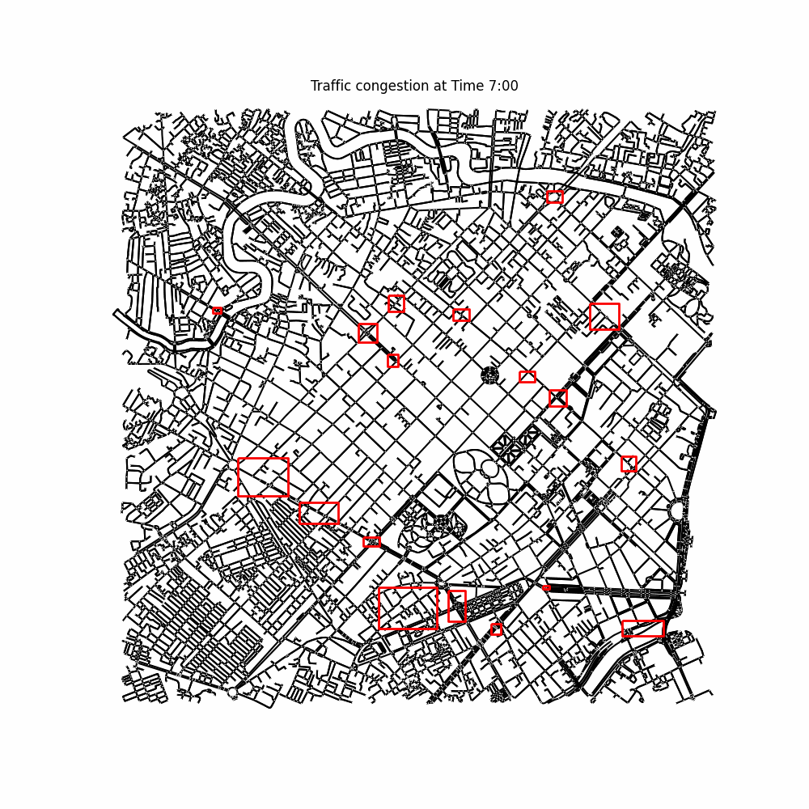

## Introduction

In this study, I apply the methodology presented in the following two papers with minor adjustments for Ho Chi Minh City (HCMC):

- Zhang, L., He, Q., & Gao, J. (2018). [Identifying Urban Traffic Congestion Pattern from Historical Floating Car Data](https://doi.org/10.1016/j.trc.2018.03.021). *Transportation Research Part C: Emerging Technologies, 89*, 123–138.  
- Birant, D., & Kut, A. (2007). [ST-DBSCAN: An Algorithm for Clustering Spatial–Temporal Data](https://doi.org/10.1016/j.patrec.2007.02.003). *Pattern Recognition Letters, 28*(3), 190–206.  

By leveraging these methodologies, I analyze urban traffic congestion patterns using historical floating car data while adapting the spatial-temporal clustering approach of ST-DBSCAN to better fit the characteristics of HCMC’s road network and traffic conditions.

### Run:
`pip install st-dbscan`
Run: cluster.py -> aggregate.py -> (plot.py/timelapse.py)

### Result:

